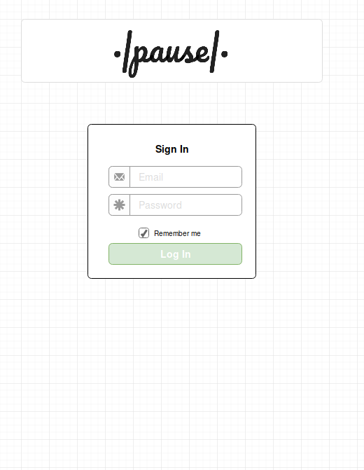
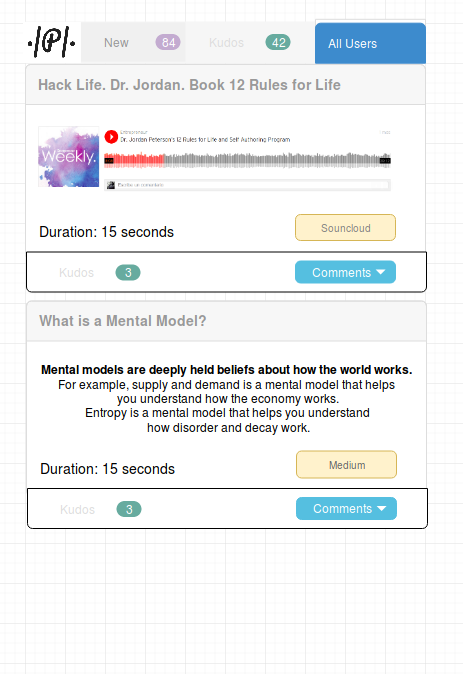
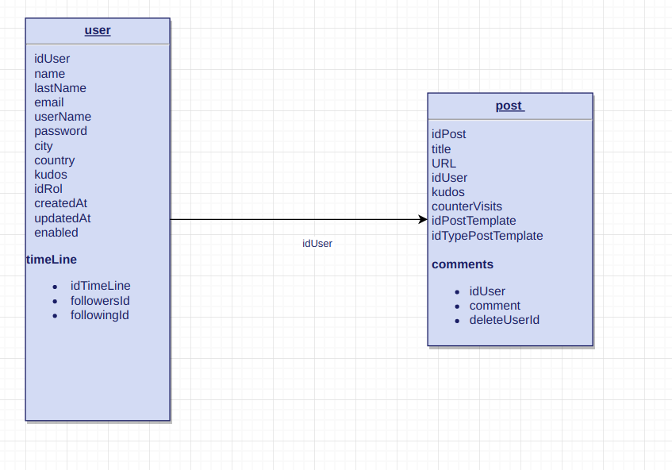
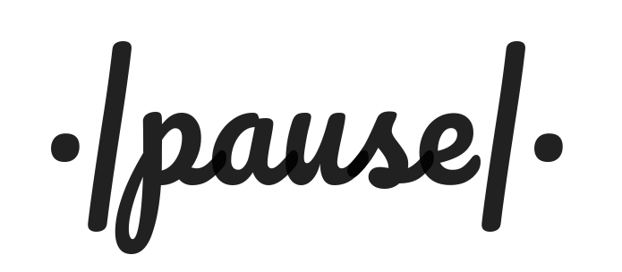
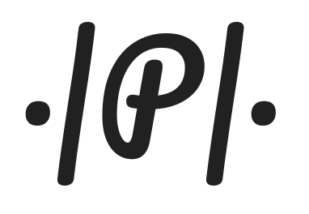
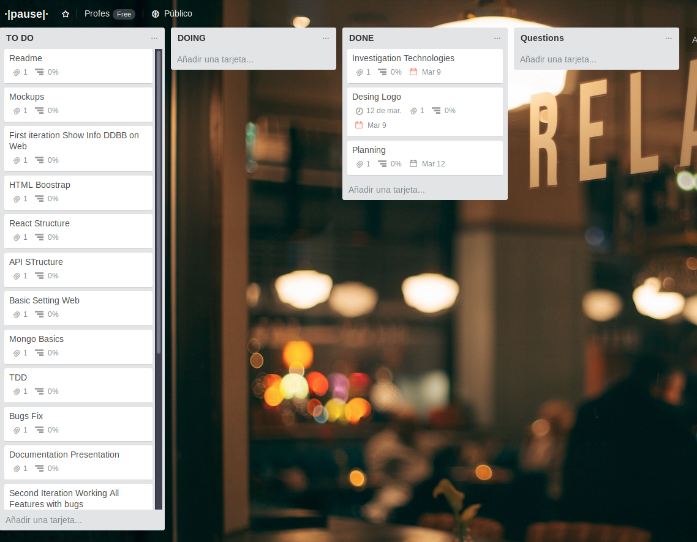

# pause

## Definition two lines:

    Pause is a calmness, concise and interesting way to share your
    lighting moments on books, photos, videos or podcasts. 

## Mockups

### Landing Page

### Sign In Page

### YouTube Post

### Timeline

## Data Model

## Logo

 Lightweight logo created with one Google Font that can integrate easily anywhere.

### Logo

### Short Logo

# Kanban

[Trello / Gantt ](https://trello.com/b/sQLDfwlX)

## Trello

## Gantt

## Calendar

# API

This proyect is connected to a specific API.

[API Pause](https://github.com/mediacloner/pause-api)

